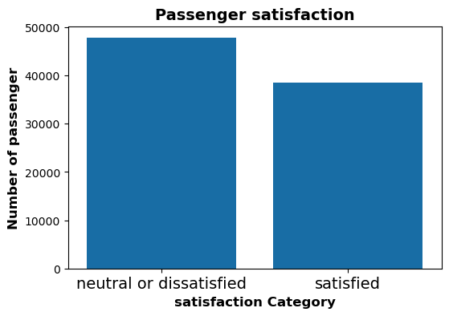

## Prediction of Airline Passenger Satisfaction using Classification Models¶

This project aimed to use a Classification models on an airline passenger satisfaction dataset to predict clients satisfaction depends on many features. We have trained our data on four model: KNN models, Descion Tree model, Logistic regression model and Random Forest model.

## Data Collection

- We used a dataset of airline passenger satisfaction survey from https://www.kaggle.com.
- The dataset contains 129880 rows and 25 columns.

Our EDA steps :

- dropped all duplicated and unneeded rows and columns
- strip all spaces and unwanted characters
- remove outliers .
- Converted categorical data into numeric

After cleaning the data set the remain rows are 86388

From the plot below, we can say the our data is balanced and it does not need to implement a resampling methods.

We built several models and the best one so far is Random Forest model

## Future work

we will train various machine learning algorithms like:
    
- Gradient Boosted
- Navie Bayes
- Support Vector Machines

and tuning the hyperparameters for the models

